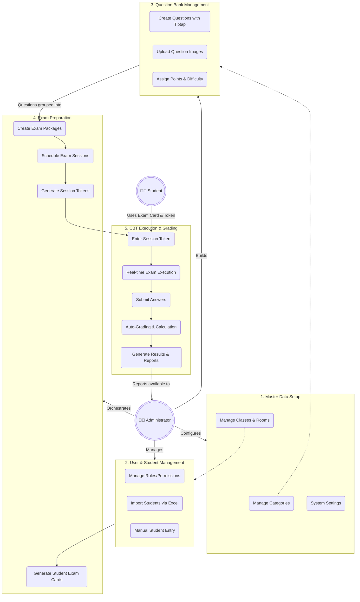

# New CBT (Computer Based Test System)

A modern, full-stack web application for managing online examinations, student records, and comprehensive question banks. Built with a robust Laravel backend and a reactive Vue 3 + Inertia.js frontend.

## 🚀 Technology Stack

### Backend
*   **Framework**: [Laravel 12](https://laravel.com/) (PHP 8.2+)
*   **Authentication**: Laravel Fortify
*   **Authorization**: [Spatie Laravel Permission](https://spatie.be/docs/laravel-permission)
*   **File Handling & Imports**: [Maatwebsite Excel](https://laravel-excel.com/) (for robust Excel data import/export)
*   **Database**: Eloquent ORM with comprehensive migration schemas.

### Frontend
*   **Framework**: [Vue.js 3](https://vuejs.org/) (Composition API) with TypeScript
*   **Routing & SSR**: [Inertia.js](https://inertiajs.com/)
*   **Styling**: [Tailwind CSS v4](https://tailwindcss.com/)
*   **UI Components**: [shadcn-vue](https://www.shadcn-vue.com/) & [Reka UI](https://reka-ui.com/)
*   **Rich Text Editor**: [Tiptap](https://tiptap.dev/)
*   **Icons**: Lucide Vue Next

---

## 🏗️ Architecture & Structure

The project strictly follows a clean architecture tailored for Laravel and Inertia:

### Backend Structure
*   `app/Models/`: Contains Eloquent models covering the entire domain (Master Data, Question Banks, Exam Execution, and Results).
*   `app/Http/Controllers/Admin/`: Dedicated controllers for handling administrative dashboard operations.
*   `app/Http/Requests/`: Form Request validation classes ensuring robust data integrity before it reaches controllers.
*   `app/Services/`: Implements the **Service Pattern** to decouple complex business logic from controllers (e.g., `StudentImportService`, `QuestionService`, `SettingService`).
*   `database/migrations/`: Exhaustive database schemas specifically designed for a highly relational examination system.

### Frontend Structure
*   `resources/js/pages/`: Inertia page components organized by domain (`Admin/Classes`, `Admin/Questions`, `Admin/Students`, etc.).
*   `resources/js/components/`: Reusable, accessible UI primitives provided primarily by shadcn-vue.
*   `resources/js/layouts/`: Application shell and layout structures.

---

## 📊 Application Flow Diagram

The following diagram illustrates the high-level feature flow and how different modules interact within the application:



---

## 👥 User Roles & Flow (Use Cases)

The application defines two primary roles, each with distinct permissions and workflows:

### 1. Administrator (Admin / Teacher)
The administrator holds full control over the application's master data, content creation, and examination orchestration.

**Admin Workflow (Use Cases):**
1.  **System Setup**: Logs in and configures general system settings.
2.  **Master Data Preparation**: Creates Categories/Sub-Categories (e.g., *Mathematics -> Algebra*), defines Classes, and sets up Exam Rooms.
3.  **Student Management**: Enrolls students manually or handles bulk imports via Excel, linking students to their respective classes.
4.  **Content Creation (Question Bank)**: Authors questions using the rich-text Tiptap editor, uploads necessary images, assigns points, and tags difficulty levels.
5.  **Exam Orchestration**:
    *   Creates an **Exam Package** and fills it with selected questions from the bank.
    *   Creates an **Exam Session**, assigning the exam package to specific classes or rooms.
    *   Generates a unique **Session Token** to be distributed to students.
    *   Generates and prints/distributes **Student Exam Cards** containing login credentials.
6.  **Monitoring & Reporting**: After the exam, the Admin views auto-graded results, monitors active sessions, and exports final reports.

### 2. Student (Examinee)
The student's access is strictly isolated to the execution of examinations.

**Student Workflow (Use Cases):**
1.  **Authentication**: Logs into the CBT portal using the credentials provided on their **Student Exam Card**.
2.  **Session Entry**: Enters the secure **Session Token** provided by the proctor/admin to access the scheduled exam.
3.  **Exam Execution**: 
    *   Navigates through questions in a distraction-free UI.
    *   Monitors remaining time via the real-time exam timer.
    *   Submits answers iteratively or sequentially.
4.  **Submission**: Submits the final exam once completed or when the timer expires. (They do not typically see immediate results unless configured by the admin).

---

## ✨ Features

### 1. User & Role Management
*   Complete authentication flow managed via Fortify.
*   Role-based access control leveraging Spatie Permissions.
*   Admin dashboard for user management.

### 2. Master Data Administration
*   **Categories & Sub-Categories**: Hierarchical organization for subjects or question topics.
*   **Classes & Rooms**: Infrastructure management for students and physical/virtual exam groupings.
*   **System Settings**: Global application configurations managed directly from the admin UI.

### 3. Student Management
*   Detailed student records tied to specific classes.
*   **Advanced Excel Import**: Features an Excel template download, file upload with **data preview capability**, and robust error handling via `StudentImportService`.

### 4. Comprehensive Question Bank
*   Create and manage complex questions.
*   Support for multiple question types, points/weights, and difficulty levels.
*   **Rich Media Support**: Integrated Tiptap editor for rich text formatting and linked `QuestionImage` handling for visual aids.

### 5. Advanced CBT Engine (Underlying Schema)
*The database architecture is fully mapped to support a state-of-the-art testing environment:*
*   **Exam Packaging**: Group questions into `ExamPackages` and manage `ExamPackageItems`.
*   **Exam Sessions**: Schedule exams, define specific configurations (`ExamSessionConfiguration` for timers, passing scores), and generate secure access tokens (`ExamSessionToken`).
*   **Execution & Grading**: Track real-time student participation (`ExamStudent`), capture individual answers (`ExamAnswer`), and automatically compute final results and reports (`ExamResult`, `ExamReport`).
*   **Exam Cards**: Generation of specific `StudentExamCard` credentials.

---

## 🛠️ Getting Started

### Prerequisites
*   PHP ^8.2
*   Node.js & npm/yarn
*   Composer
*   MySQL/PostgreSQL Database

### Installation

1.  **Clone the repository & install PHP dependencies:**
    ```bash
    composer install
    ```

2.  **Environment Setup:**
    ```bash
    cp .env.example .env
    php artisan key:generate
    ```
    *Configure your database credentials in the `.env` file.*

3.  **Run Migrations & Seeders:**
    ```bash
    php artisan migrate --seed
    ```
    *Ensure you run the seeders to populate initial Roles, Permissions, and Admin users.*

4.  **Install Node dependencies & Compile Assets:**
    ```bash
    npm install
    npm run build
    # or for development: npm run dev
    ```

5.  **Serve the application:**
    ```bash
    php artisan serve
    ```
